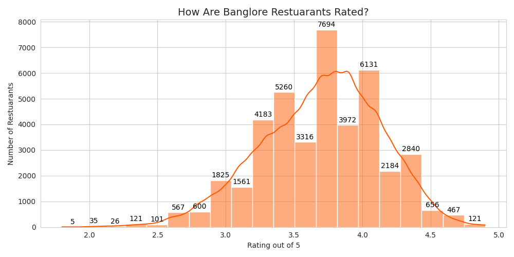
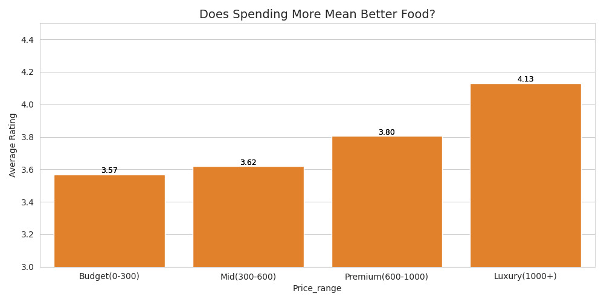
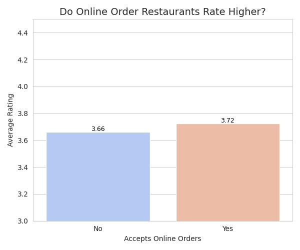
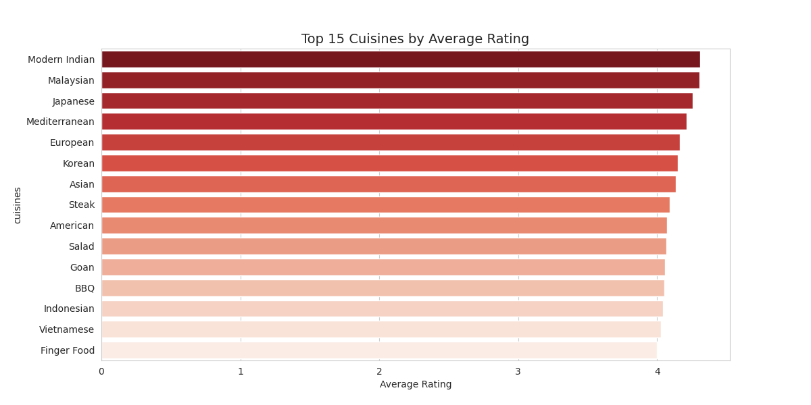
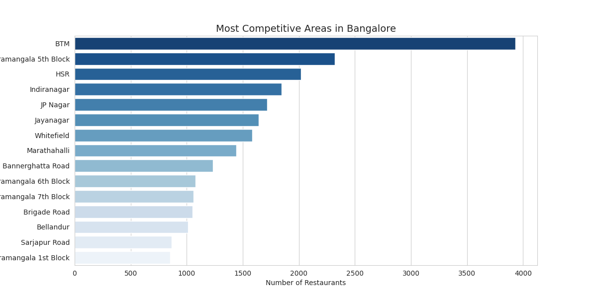

# Zomato Bangalore Market Analysis

## Business Problem
What makes a restaurant successful in Bangalore's 
highly competitive food market? This analysis 
identifies key factors — pricing, cuisine, location, 
and online ordering — that drive customer ratings.

## Dataset
- Source: Kaggle (Zomato Bangalore Restaurants Dataset)
- Original size: 51,517 restaurants, 17 columns
- After cleaning: 41,665 restaurants, 15 columns

## Tools Used
Python | Pandas | Matplotlib | Seaborn | Google Colab

## Data Cleaning
- Converted rate column from text ("4.1/5") to numeric
- Removed commas from cost column and converted to numeric
- Removed 2 duplicate rows
- Dropped rows with null ratings (15.03% missing — 
  primary metric)
- Filled null cuisines with 'Unknown' (0.09% missing)
- Filled null costs with median (0.67% missing, 
  avoids outlier skew)
- Dropped dish_liked column (54.29% missing)
- Dropped phone column (not relevant to analysis)

## Business Questions Answered
1. How are Bangalore restaurants rated overall?
2. Does price affect customer ratings?
3. Do online ordering restaurants rate higher?
4. Which cuisines have the best ratings?
5. Which areas are most competitive?

## Key Findings

**Price vs Rating**
- Budget (0-300): 3.57 avg rating
- Mid (300-600): 3.62 avg rating
- Premium (600-1000): 3.80 avg rating
- Luxury (1000+): 4.13 avg rating
- Higher price correlates with higher ratings, 
  but Budget and Mid are nearly identical — 
  best value sits in mid-range

**Online Ordering Impact**
- Without online order: 3.66 avg rating
- With online order: 3.72 avg rating
- Small but consistent advantage for restaurants 
  offering online ordering

**Top Cuisines**
- Modern Indian and Malaysian top the list (~4.35)
- Japanese, Mediterranean, European also in top 5
- International and fusion cuisines outperform 
  traditional options in ratings

**Most Competitive Areas**
- BTM has ~4,000 restaurants — most saturated by far
- Koramangala 5th Block (~2,300) and HSR (~2,050) follow
- Bellandur and Sarjapur Road have lowest competition 
  (~850-900) among major areas

## Business Recommendation
For a new restaurant entering Bangalore:
1. **Location**: Target Bellandur or Sarjapur Road 
   (low competition, growing areas) — avoid BTM
2. **Cuisine**: Focus on Modern Indian or Malaysian 
   for highest rating potential
3. **Pricing**: Mid-range (300-600 for two) offers 
   best value-to-rating ratio
4. **Online Ordering**: Enable from day one for a 
   consistent rating advantage
5. **Quality Target**: Aim above 4.0 rating — 
   all top-performing cuisines exceed this

## Visualizations

## Notebook
[Link to full analysis notebook](zomato_analysis.ipynb)
